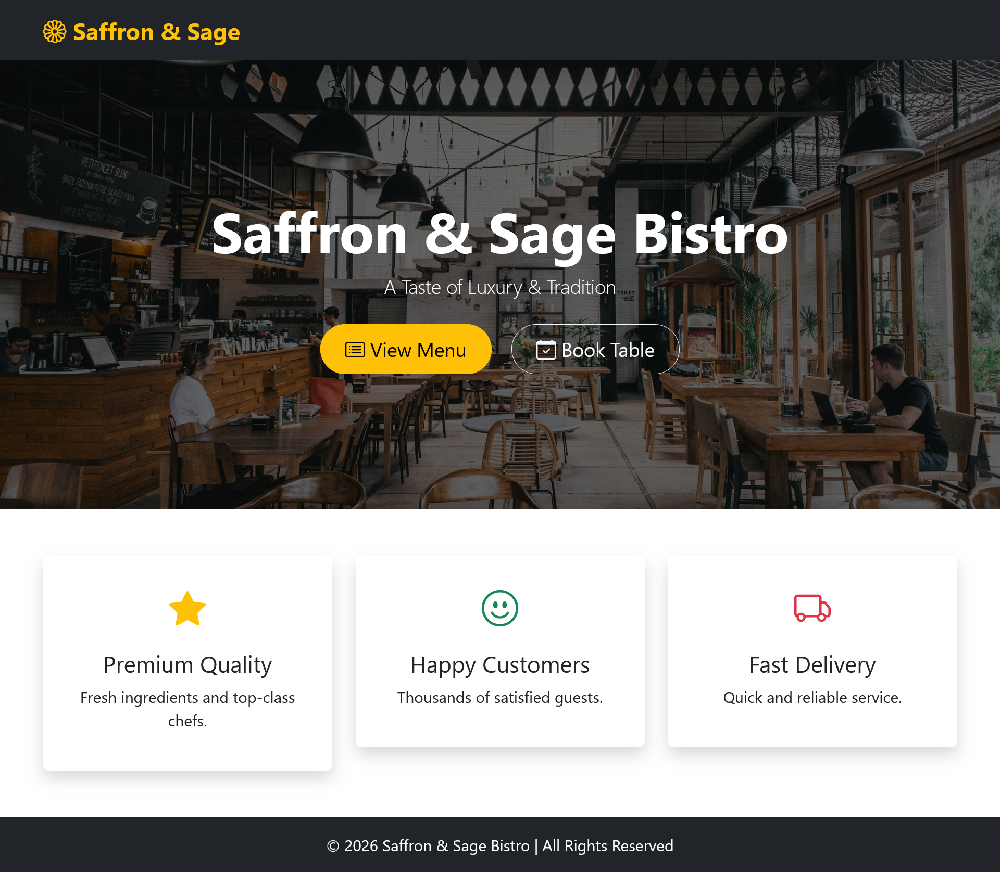
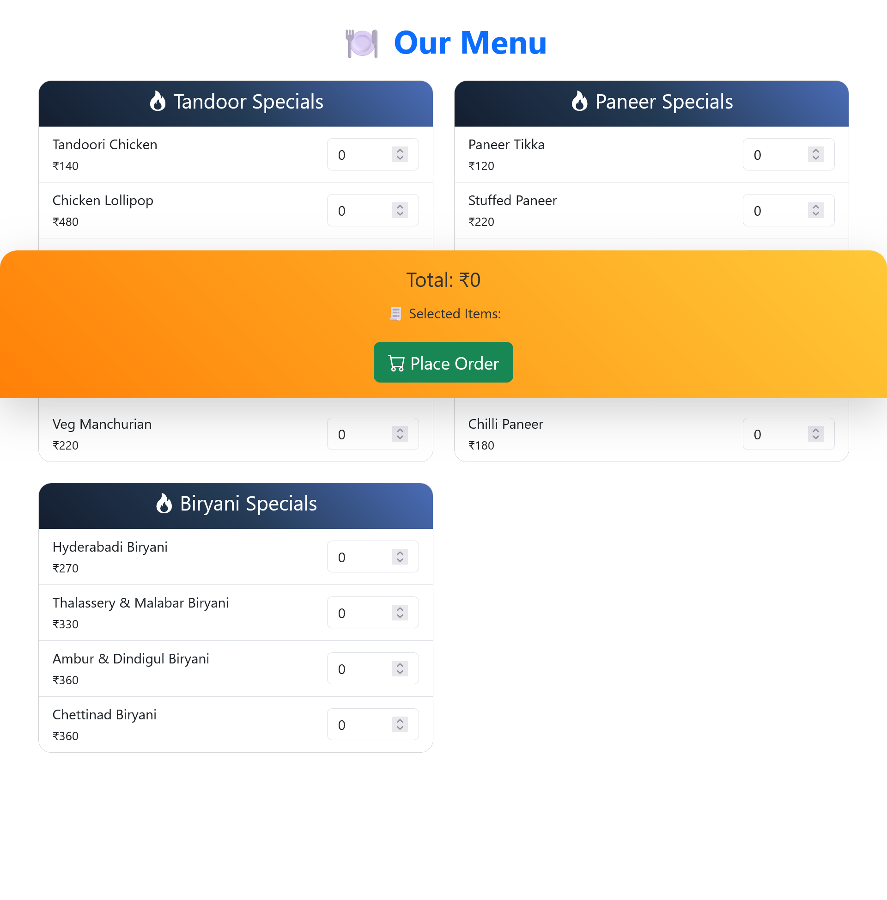
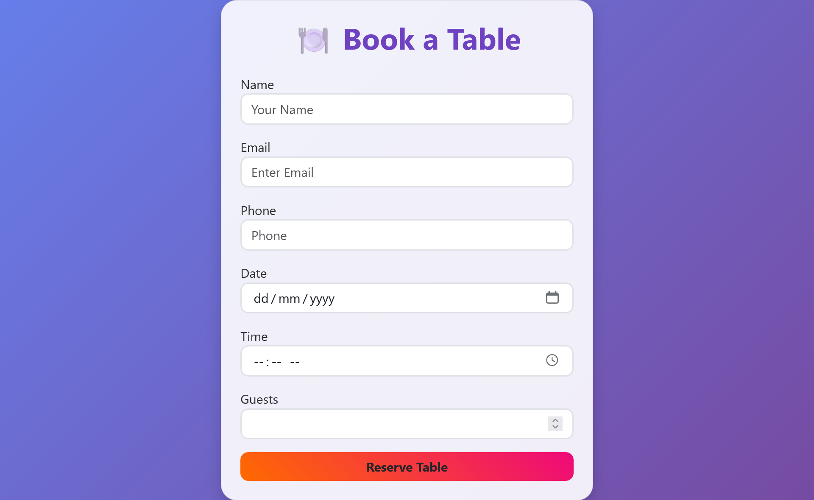

🍽️ Saffron & Sage Bistro
A full-stack restaurant website built with Django — featuring a homepage, an interactive menu ordering system, and a table reservation form. Built as a portfolio project to demonstrate full-stack development skills.

🔗 GitHub: https://github.com/Keerthi-3009/restaurant-project
🌐 Live Demo: _add your live link here once deployed_

Features

* Homepage with hero banner, tagline, and quick-access buttons (View Menu, Book Table)
* Browse restaurant menu items by category (e.g. Tandoor Specials, Paneer Specials)
* Select item quantities and see them added to the order in real time
* Running order total and selected-items summary
* Place Order button to submit the order
* Book a Table reservation form (name, email, phone, date, time)
* Django admin dashboard for managing menu items

Tech Stack

* Backend: Python, Django
* Database: SQLite
* Frontend: HTML, CSS, Bootstrap
* Tools: VS Code, Git/GitHub

Screenshots
Homepage

Menu Order Page

Book a Table

Setup Instructions

1. Clone the repository