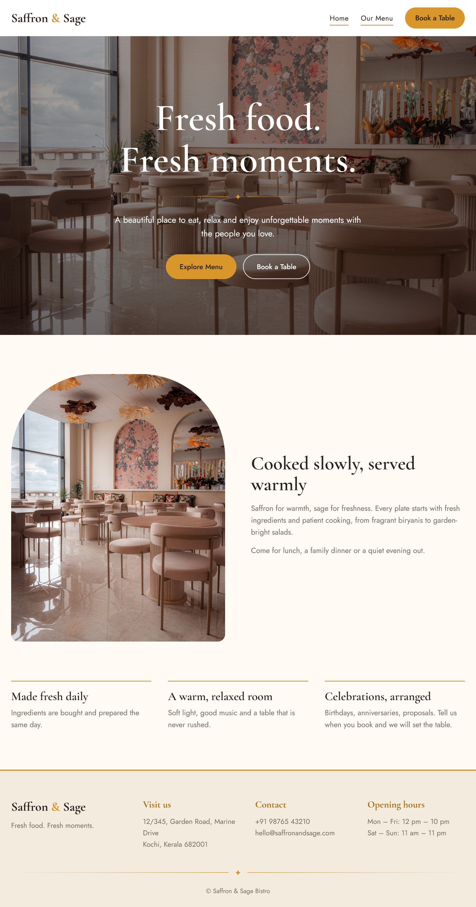
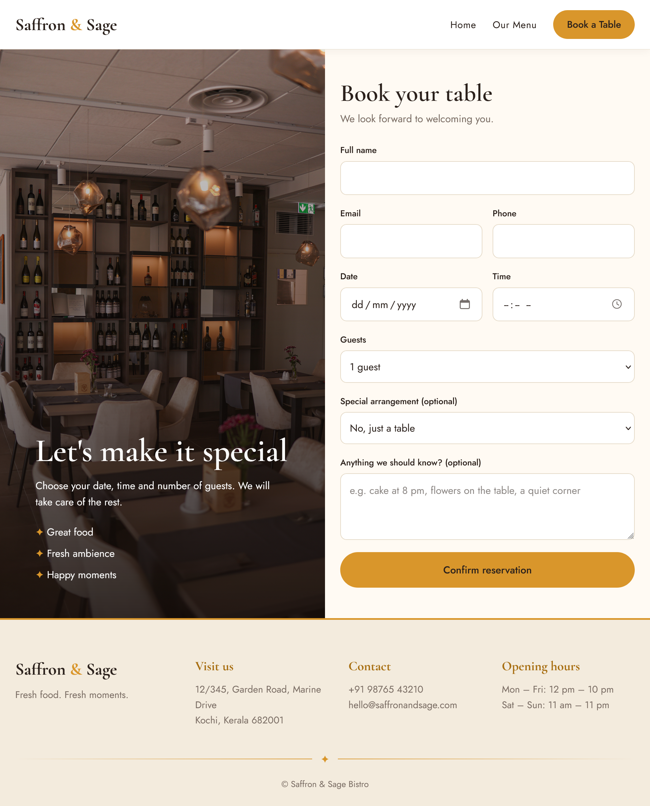

# Saffron & Sage Bistro

A full-stack restaurant website built with Django. Guests can browse a categorized menu and reserve a table online, and staff manage menu items and reservations from the Django admin.

**Live Demo:** [https://restaurant-project-pr4c.onrender.com](https://restaurant-project-pr4c.onrender.com)

**GitHub:** [https://github.com/Keerthi-3009/restaurant-project](https://github.com/Keerthi-3009/restaurant-project)


> The app runs on Render's free plan, so the first request after a period of inactivity can take up to 50 seconds while the service starts.

---

## Overview

The project covers the core workflow of a small restaurant website: presenting the menu to guests, collecting table reservations, and giving staff a simple back office. It was built to practice Django models, views, templates, admin customization and deployment.

## Screenshots

### Home


### Menu


### Book a Table



## Features

**For guests**
- Home page with a photo hero and quick links to the menu and booking form
- Menu grouped by category, with separate Vegetarian and Non-vegetarian sections and a marker on each dish
- Table reservation form: name, email, phone, date, time and number of guests
- Optional special arrangement (birthday, anniversary, date night, proposal) with a notes field
- Responsive layout for mobile and desktop

**For staff**
- Django admin to create categories, add dishes with price, description and photo (upload or image link), and mark dishes as available or unavailable
- Control over which categories show the Veg / Non-veg marker
- Reservations stored in the database and listed in the admin, with filters by date and occasion

## Tech Stack

| Area | Technology |
|------|------------|
| Language | Python 3 |
| Framework | Django |
| Database | SQLite |
| Frontend | HTML, CSS (custom, no framework) |
| Static files | WhiteNoise |
| Hosting | Render |
| Tools | Git, GitHub, VS Code |

## Data Model

| Model | Key fields |
|-------|-----------|
| `Category` | name, display order, show food-type marker |
| `MenuItem` | category, name, description, price, food type (Veg / Non-veg), image or image URL, availability |
| `Reservation` | name, email, phone, date, time, guests, occasion, special request |

## Project Structure

```
restaurant-project/
├── manage.py
├── requirements.txt
├── restaurant/                 # main app
│   ├── models.py
│   ├── views.py
│   ├── urls.py
│   ├── admin.py
│   ├── templates/restaurant/   # base, home, menu, book_table
│   └── static/                 # css and images
├── restaurant_project/         # project settings and root URLs
└── screenshots/
```

## Getting Started

1. Clone the repository
```
   git clone https://github.com/Keerthi-3009/restaurant-project.git
   cd restaurant-project
```
2. Create and activate a virtual environment
```
   python -m venv venv
   venv\Scripts\activate        # Windows
   source venv/bin/activate     # macOS / Linux
```
3. Install dependencies
```
   pip install -r requirements.txt
```
4. Apply migrations
```
   python manage.py migrate
```
5. Create an admin user
```
   python manage.py createsuperuser
```
6. Start the development server
```
   python manage.py runserver
```

The site is available at `http://127.0.0.1:8000/` and the admin at `http://127.0.0.1:8000/admin/`.

## Managing the Menu

1. Sign in to `/admin/`.
2. Add categories (for example Starters, Biryani, Desserts). Untick **Show food type** for categories such as Desserts and Beverages.
3. Add menu items under a category, set the food type, and optionally add a photo. Items without a photo show a matching default image.

## Deployment

The app is deployed on Render from the `main` branch. The build command installs dependencies, collects static files and applies migrations:

```
pip install -r requirements.txt && python manage.py collectstatic --noinput && python manage.py migrate
```

## Future Improvements

- Email confirmation for new reservations
- Table availability checks to prevent double bookings
- Online ordering and payments
- PostgreSQL and cloud image storage for production

## Author

**Keerthi**
GitHub: [@Keerthi-3009](https://github.com/Keerthi-3009)